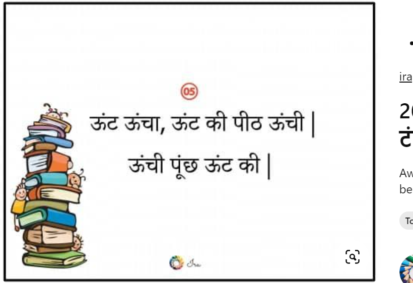

### Chinese Whisper Game Rules and Regulations

#### Team Composition
- 4 teams with 10 members each.

#### Objective
- Pass a message through the team by whispering it from one person to the next. The final person in line says the message out loud, and the team with the most accurate message wins.

#### Setup
1. Teams line up or sit in a straight line.
2. Ensure enough space between teams to prevent overhearing.

#### Game Rules
1. A game master prepares a message to be whispered.
2. The first player in each team receives the message from the game master.
3. The message is whispered once to the next team member.
4. Each player whispers the message to the next player in line until it reaches the last person.
5. The last player in each team says the message out loud.

#### Winning Criteria
- The team with the most accurate message at the end wins.
- If no team has the exact message, the closest one wins.

#### Penalties
1. Any player caught repeating the message or speaking out loud will cause their team to restart with a new message.
2. Teams cannot ask for the message to be repeated by the person whispering it to them.

#### Safety and Fair Play
1. Ensure the playing area is quiet to maintain game integrity.
2. Respect other teams and do not attempt to overhear or disrupt them.
3. Any form of cheating or intentional disruption will result in disqualification.

#### Additional Notes
1. The messages should be clear but challenging enough to make the game fun.
2. Have a referee or supervisor to ensure rules are followed and to provide the initial message.
3. Encourage good listening skills and clear whispering among participants.

This game promotes careful listening, clear communication, and teamwork.

